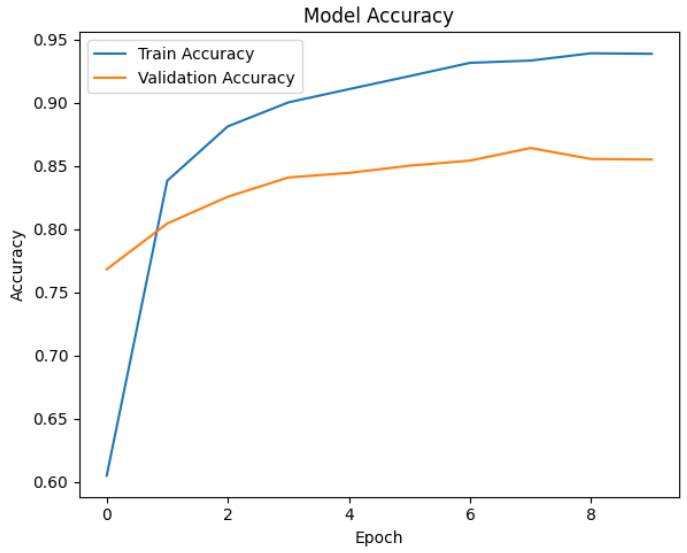

 Food Spoilage Prediction
This project predicts whether a food item is fresh or spoiled based on its properties using machine learning. It helps in reducing food waste, improving safety, and optimizing inventory management for food suppliers, retailers, and households.

 Features
Predicts freshness or spoilage from food data.

Uses machine learning models for classification.

Supports multiple input features such as temperature, humidity, storage time, and more.

Can be extended for real-time prediction using IoT sensors.

 Dataset
The dataset contains features like:

Temperature (°C) – Storage temperature of the food item.

Humidity (%) – Environmental moisture level.

pH Level – Acidity or alkalinity of the food.

Storage Time (days) – Duration since storage.

Gas Emission Levels – CO₂ / Ethylene levels from packaging.

Visual Quality – Color changes or spots (if available).

Target Variable:

0 → Fresh

1 → Spoiled

 Installation
bash
Copy
Edit
# Clone the repository
git clone https://github.com/yourusername/food-spoilage-prediction.git
cd food-spoilage-prediction

# Install dependencies
pip install -r requirements.txt
 Usage
 Train the Model
bash
Copy
Edit
python train.py
 Predict on New Data
bash
Copy
Edit
python predict.py --temp 5 --humidity 70 --ph 6.5 --time 4 --gas 0.02
 Model Information
Preprocessing: StandardScaler for feature scaling.

Models Tested:

Logistic Regression

Random Forest Classifier

XGBoost

Best Accuracy Achieved: ~92% with Random Forest.

📊 Example Output
Input:

json
Copy
Edit
{
  "Temperature": 8,
  "Humidity": 80,
  "pH": 6.2,
  "Storage_Time": 7,
  "Gas_Emission": 0.05
}
Prediction:

json
Copy
Edit
{
  "Status": "Spoiled"
}
 Future Improvements
Real-time IoT sensor data integration.

Deep learning for image-based freshness detection.

Mobile application interface.

Author
Sagnik Patra

